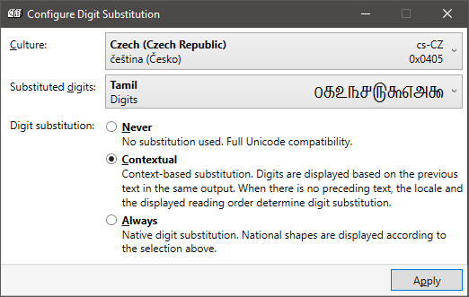

# SetDigitSubstitution

SetDigitSubtititon is a tool to configure digit substition on Windows 10. The ability to change digit substitution settings has unfortunately been removed from the Control Panel in Windows 10 Version 1903.

### What is digit subtitution?

Digit substitution is a feature of the operating system that replaces digits 0-9 with native digits from different script anywhere in the user interface during rendering. The underlying data remain unchanged, it is only a "display effect". For example, a text file with numbers 0123456789 will be shown as १२३४५६७८९० when Hindi digits are substituted.